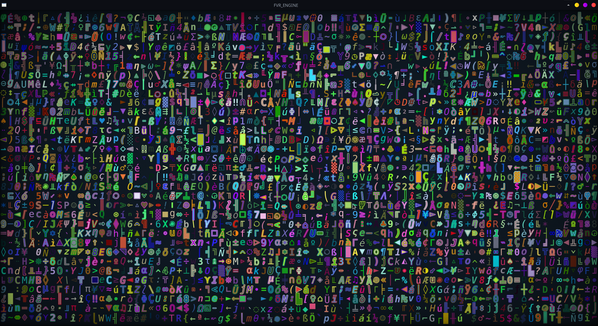

```
  ________ ___      ___ ________   _______   ________   ________  ___  ________   _______
 |\  _____\\  \    /  /|\   __  \ |\  ___ \ |\   ___  \|\   ____\|\  \|\   ___  \|\  ___ \
  \ \  \__/\ \  \  /  / | \  \|\  \\ \   __/|\ \  \\ \  \ \  \___|\ \  \ \  \\ \  \ \   __/|
   \ \   __\\ \  \/  / / \ \   _  _\\ \  \_|/_\ \  \\ \  \ \  \  __\ \  \ \  \\ \  \ \  \_|/__
    \ \  \_| \ \    / /   \ \  \\  \|\ \  \_|\ \ \  \\ \  \ \  \|\  \ \  \ \  \\ \  \ \  \_|\ \
     \ \__\   \ \__/ /     \ \__\\ _\ \ \_______\ \__\\ \__\ \_______\ \__\ \__\\ \__\ \_______\
      \|__|    \|__|/       \|__|\|__| \|_______|\|__| \|__|\|_______|\|__|\|__| \|__|\|_______|
```

A Rusty Re-Write of the _CabinFever_ game engine.

A data-driven text-based roleplaying game engine.



## TODO

- implement everything from C# engine.
  - [x] faux terminal rendering
  - [x] rich text parsing and drawing
  - [x] user input & derivative actions handling
  - [x] input repeater
  - [x] scenes:
    - [x] initial
    - [x] main menu
    - [ ] demo (explore)
    - [ ] credits
    - [ ] help
    - [x] fade in/out animations
    - [ ] transition animations
  - [ ] tile cache deserialized
  - [ ] cell cache deserialized
  - [ ] color palette deserialized
  - [ ] dynamic prefabs
  - [ ] shadowcasting fov
  - [ ] geometrical types
  - [ ] line drawing
  - [ ] modal popups
  - [ ] scrolling dialogue windows

- implement "huge" characters
  - perhaps also per-tile implement animations that "live" in the client?
    - shake
    - rotate
    - wobble back and forth
    - grow and shrink

- implement static/dynamic color palettes
- implement ability to switch between vsync and custom fps in client.

## CRATES

### fvr_engine
The main FVR_ENGINE crate. Runs a game from config files.

Includes a "scene stack" for managing game scenes.

### fvr_engine-core
Lib containing commonly shared types.

- traits for map2d
- tile and related structs
- glyph/font metrics for deserialization
- timer
- translate map for viewing map2d with translation
- grid map for exposing map2d backed by vec
- cp437 helpers

### fvr_engine-atlas_generator

Utility for generating atlas textures for codepage 437 from TTF fonts.
Ensures that all codepoints are covered by filling in any missing entries with DejaVuSansMono.

TODO: Write more detailed tutorial

Basic steps:

  - generate 64pt regular, italic, bold, bold-italic & outline versions for each from bmfont
    - use glyphs.txt to choose codepoints
  - rename to remove page number from filenames
  - open each outlined texture in gimp and do the following:
    - pick `color to alpha` to remove white
    - pick `colorize` to change black outlined back to white
  - stick in directory under fonts/
  - run with `cargo run -p fvr_engine-atlas_generator -- run` while in root dir of project
  - output goes to resources/fonts/

### fvr_engine-client
Lib for handling the game window, user input, and drawing to the faux terminal.

### fvr_engine-parser
Lib containing text parsers, including:
- a rich text parser for parsing text that contains inline format hints

## TASKS

- continue adapting C# implementation.
- refactor frame to use rect?
- change Grid/Sub map new() parameters to dimensions: (u32, u32) instead of width/height>
- move transitions to client?
- implement shake effect
- MAKE SURE possible overflow is handled with u32 <-> i32 coord conversions!
- change dijkstra processed to use grid map.
- go back through code that uses "unwrap" and make sure ".as_ref().unwrap()" is not a better alternative.

## CONVENTIONS

- Frames work best with _odd_ dimensions.
- Managing cursor should _always_ be done at the root scene level.
- includes order:
  - "STD Includes."
  - "Extern crate includes."
  - "Workspace includes."
  - "Local includes."
  - "Constants."
  - "Statics."